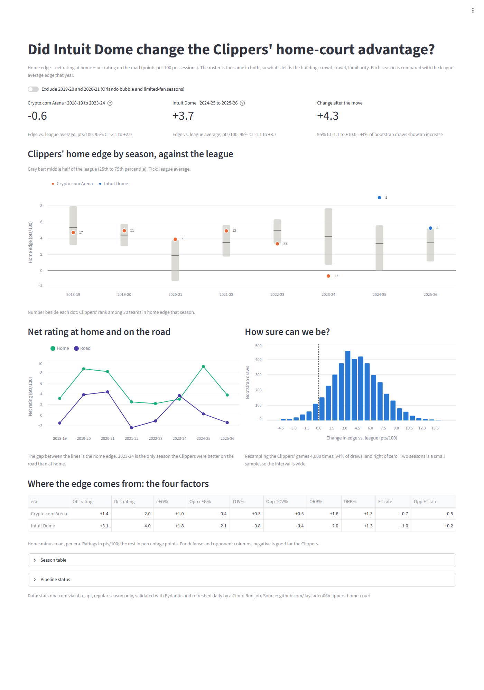
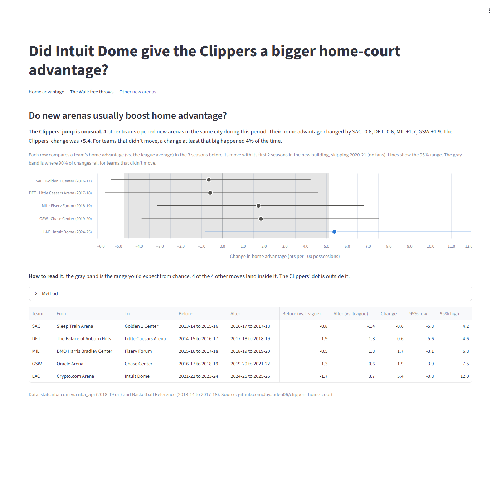
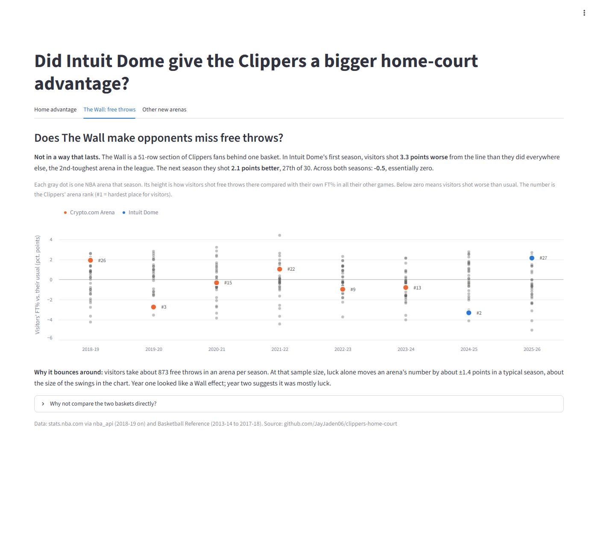

# clippers-home-court

[](https://github.com/JayJaden06/clippers-home-court/actions/workflows/ci.yml)

**[Live dashboard →](https://clippers-home-court-h46at8hpdebg9gdcaunm87.streamlit.app)**

**Did moving into Intuit Dome change the Clippers' home-court advantage?**

For six seasons the Clippers shared Crypto.com Arena (formerly Staples Center) with the Lakers.
In 2024-25 they moved into Intuit Dome, a building designed around a home crowd, including
the 51-row "Wall" behind one basket. This repo pulls every regular-season NBA game since
2013-14, validates it with Pydantic, stores it as Parquet, and puts a Streamlit dashboard on top
to answer that one question.



## Findings

**Home edge** = net rating at home minus net rating on the road, in points per 100 possessions.
The same roster plays both halves of the schedule, so team quality mostly cancels out. What's
left is the venue: crowd, travel, sleep, familiarity. Each season is measured against that
season's league-average edge, which absorbs league-wide swings such as the empty-arena 2020-21
season.

| Clippers home edge vs. league average | Seasons | Home games | Excess edge (pts/100) | 95% CI |
|---|---|---|---|---|
| Crypto.com Arena | 2018-19 to 2023-24 | 232 | **−0.6** | −3.1 to +2.0 |
| Intuit Dome | 2024-25 to 2025-26 | 82 | **+3.7** | −1.1 to +8.7 |
| **Change** | | | **+4.3** | −1.1 to +10.0 |

- **Shared arena: a below-average home court.** Over six seasons the Clippers' home edge was
  slightly below the league's. In their final season there (2023-24) they were 27th of 30 and
  played *better* on the road than at home, the only season in the sample where that happened.
- **Intuit Dome, year one: the best home court in the league.** In 2024-25 the Clippers ranked
  1st of 30 in home edge (+9.0 against a league average of +3.3). In 2025-26 they ranked 8th
  (+5.2 against +3.4).
- **The gain came mostly on defense.** Comparing home with road, opponents' effective FG% drops
  2.1 points at Intuit Dome, against 0.4 at the old arena. Defensive rating at home improved by
  4.0 pts/100 relative to the road, against 2.0 before.
- **How sure is this?** In 94% of 4,000 bootstrap resamples the change is positive, but the 95%
  interval still crosses zero. Two seasons is 82 home games, so the evidence is strong but not
  yet conclusive. If you drop the bubble season and the limited-fan season (2019-20, 2020-21),
  the change grows to **+5.1** (96% of resamples positive). Re-running the ingest job during
  2026-27 adds new games, so the interval will narrow as the season goes on.

*What this doesn't control for:* roster changes between eras (this measures home edge, not
team strength, but a roster can still be better suited to home or road play), schedule
density, and rest. A natural next step is a game-level regression with opponent strength and
rest days.

### Is it the building? Other teams' arena moves



Four other teams opened new arenas in the same city during 2013-2026. For each one, I compared
its home edge (vs. the league average) in the 3 seasons before the move with its first 2
seasons in the new building, skipping the no-fan 2020-21 season. Subtracting the league average
each season makes this a difference-in-differences against the rest of the league.

| Move | Change (pts/100) | 95% CI |
|---|---|---|
| Kings → Golden 1 Center (2016) | −0.6 | −5.3 to +4.2 |
| Pistons → Little Caesars Arena (2017) | −0.6 | −5.6 to +4.6 |
| Bucks → Fiserv Forum (2018) | +1.7 | −3.1 to +6.8 |
| Warriors → Chase Center (2019) | +1.9 | −3.9 to +7.5 |
| **Clippers → Intuit Dome (2024)** | **+5.4** | −0.8 to +12.0 |

As a chance baseline, I ran the same before/after calculation for every team at every season
where nothing happened (223 comparisons). A change of +5.4 or more came up **4%** of the time.
New arenas don't reliably raise home advantage, so the Clippers' jump stands out. (With the
same 3-before/2-after window for everyone, the Clippers' change is +5.4 instead of the +4.3
from the six-season comparison above.)

### Does The Wall make opponents miss free throws?



**Not in a way that lasts.** For every arena and season, I compared visitors' free-throw
shooting there with their own FT% in all their other games. In Intuit Dome's first season,
visitors shot **3.3 points worse** than usual, the 2nd-toughest arena in the league. The next
season they shot **2.1 points better** (27th). Across both: **−0.5**, essentially zero. With
about 870 visitor free throws per arena-season, luck alone moves this number by about ±1.4
points, so year one looks like noise. An
[early-season study](https://abovethebreak.substack.com/p/ballmers-wall-is-the-intuit-dome)
from December 2024 reached a similar conclusion from 12 games.

The sharper test would compare free throws at the Wall end with the other end. The visiting
team picks which basket it attacks in each half, though, and the public play-by-play data
doesn't record which end a shot was at, so this measures the whole arena instead.

## How it works

```
stats.nba.com ──nba_api──────────▶ ingest job (clippers-ingest)
basketball-reference.com (≤2017-18) ─┘
                             │  Pydantic: TeamGameLine → Game
                             │  bad games quarantined + logged
                             ▼
                        data/
                          team_games/season=YYYY-YY.parquet
                          exports/team_games.csv  ──▶ Tableau
                          exports/last_run.json   (run report)
                             │
                             ▼
                     Streamlit dashboard
```

**Validation** ([models.py](src/clippers_home_court/models.py)). There are two layers:

- `TeamGameLine` checks each team's box score row on its own: field formats, makes ≤ attempts,
  3PA ≤ FGA, and `PTS == 2·FGM + FG3M + FTM`.
- `Game` pairs the two rows for a game and checks that they agree with each other: same date,
  different teams, exactly one winner, and the winner scored more.

If either side of a game fails, the whole game is rejected, so storage never holds a game with
only one side. The job writes nothing for a season if its rejection rate is above a threshold.
The current load is 31,338 team-game rows (13 seasons, 2013-14 to 2025-26) and 0 rejections.
Seasons before 2018-19 come from Basketball Reference game logs, converted to the same
columns and validated by the same models ([bbref.py](src/clippers_home_court/bbref.py)).

The validator caught one real upstream problem: in older seasons the API's team-level
`PLUS_MINUS` is sometimes fractional or disagrees with the final score (22 games in 2018-19
alone). The pipeline doesn't ingest it and derives margins from validated points instead.

**Neutral sites.** Orlando bubble games, international games (Paris, Mexico City, London) and
NBA Cup knockout games in Las Vegas are tagged `neutral` and left out of home/away splits.
From 2024-25 on they're detected from the matchup string. Earlier ones are listed by game ID in
[seasons.py](src/clippers_home_court/seasons.py).

**Idempotent runs.** Each run backfills any missing season and re-pulls the current one,
overwriting that season's parquet file. Re-running is always safe.

**Uncertainty.** Intervals come from resampling the Clippers' games with replacement, separately
for home and road and within each season. League averages are treated as fixed, since each one
is based on about 1,230 games.

## Run it

```bash
python -m venv .venv && source .venv/bin/activate   # Windows: .venv\Scripts\activate
pip install -e ".[dashboard,dev]"

clippers-ingest                 # pull/refresh into ./data
streamlit run dashboard/app.py  # dashboard on http://localhost:8501
pytest                          # 33 tests
```

A snapshot of the data is committed under `data/` so the dashboard works without running the
ingest step. The live dashboard is hosted on Streamlit Community Cloud and reads that snapshot.

**Tableau:** connect to `data/exports/team_games.csv`. It has one row
per team per game, with both teams' box scores and a `location` column of home, away or neutral.

## Layout

```
src/clippers_home_court/
  source.py     nba_api fetch with retries (2018-19 on)
  bbref.py      Basketball Reference game logs (2013-14 to 2017-18)
  models.py     Pydantic schema (TeamGameLine, Game)
  transform.py  validate + pair rows, quarantine failures
  storage.py    read/write Parquet + CSV exports
  job.py        ingest entrypoint (clippers-ingest)
  analysis.py   home edge, bootstrap, arena moves, free throws by arena
dashboard/app.py  Streamlit + Altair
tests/            schema, pairing, and metric tests
```

Data: stats.nba.com via [nba_api](https://github.com/swar/nba_api) from 2018-19 on, and
[Basketball Reference](https://www.basketball-reference.com) team game logs for 2013-14 to
2017-18 (used only for the arena-move comparison). Not affiliated with the NBA or the LA Clippers.
